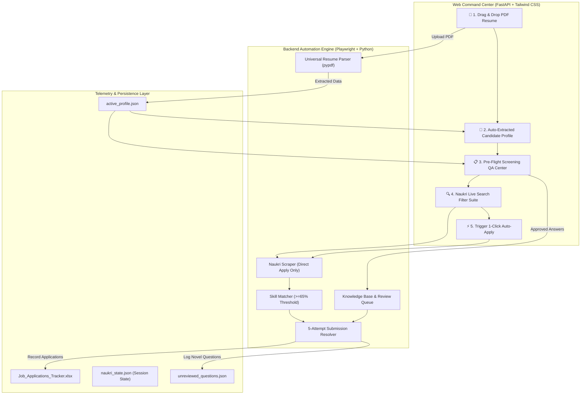

# 🚀 Universal Naukri Auto-Apply Copilot: Portfolio Architecture & Blueprint

An autonomous, full-stack, AI-powered job application system built for **Naukri.com** with **Playwright automation**, **dynamic PDF resume parsing**, **pre-flight screening question verification**, and a **real-time command center dashboard**.

Built as a flagship portfolio project demonstrating browser automation engineering, anti-bot evasions, full-stack API design, and zero-prompt user onboarding.

---

## 🌟 Executive Summary: Why This Stands Out in a Portfolio

1. **Zero-Configuration Onboarding (No Code / No Prompts Needed)**:
   - Users never have to edit YAML files, touch terminal scripts, or write Antigravity prompts.
   - Simply drag-and-drop any PDF resume into the web dashboard: the backend automatically extracts contact details, education, degree, years of experience, and 30+ domain skills.
2. **Pre-Flight Screening QA System (Option A)**:
   - Recruiter screening questions (CTC, notice period, experience, relocation, degree, work authorization) are auto-populated from the resume and presented in a dedicated review modal.
   - The user inspects and approves answers before launching a cycle.
   - If novel questions appear during live runs, the bot autonomously answers with sensible candidate heuristics and records them into a review queue for future verification.
3. **5-Attempt Strategic Submission Resolver**:
   - Handles multi-step portal hindrances: direct DOM clicks, chatbot drawer headline/pill prompts, multi-questionnaire forms, overlay clearance, and JS event dispatch.
   - Verifies submission success via ACP URL navigation, DOM confirmation banners, and intercepted HTTP network responses.
4. **Full Naukri Filter Suite**:
   - Integrates every Naukri.com search parameter: Keyword/Role, Pan-India & Custom Cities, Min/Max Salary (LPA), Experience (0 Yrs / Freshers to Senior), Freshness (24h to 30 days), Work Mode (Remote, WFO, Hybrid), and Sort Order (Relevance, Date, CTC).
   - **Strict Direct-Apply Enforcement**: Filters out and skips external redirect jobs where "Apply on company website" is displayed.
5. **Dual Live Trackers**:
   - Automatically maintains `Job_Applications_Tracker.xlsx` with categorized worksheets, formatted headers, and status badges.
   - Real-time deduplication prevents duplicate submissions to the same company and title.

---

## 🏗️ System Architecture



---

## 🤖 Exact Prompts to Give to Antigravity (Recreate from Scratch)

If someone wants to recreate this entire application from a blank folder without breaking any features, feed these five sequential prompts to Antigravity:

### Prompt 1: Project Scaffolding & Virtual Environment
```text
Create a production-grade Python project for an autonomous job application copilot focused exclusively on Naukri.com with FastAPI and Playwright.
Setup:
1. Virtual environment and requirements.txt (fastapi, uvicorn, playwright, pydantic, pyyaml, openpyxl, pypdf, httpx, python-multipart, python-dotenv).
2. Clean modular directory structure:
   - src/models.py (Data schemas for CandidateProfile, JobApplication, ApplicationStatus, ScreeningQA)
   - src/config.py (Dynamic configuration loader supporting in-app profile state)
   - src/resume_parser.py (PDF resume text & skill extractor)
   - src/excel_manager.py (Excel tracker with formatting & deduplication)
   - src/state_manager.py (Seen jobs cache & pagination state)
   - src/web/server.py (FastAPI REST endpoints)
   - src/web/templates/dashboard.html (Tailwind CSS dark mode UI)
3. Install Playwright browser dependencies (playwright install chromium).
Ensure all modules have clear separation of concerns and graceful error handling.
```

### Prompt 2: In-App Resume Parser & Dynamic Candidate Onboarding
```text
Implement an in-app candidate onboarding system in src/resume_parser.py and src/config.py:
1. Allow any user to upload a PDF resume via FastAPI endpoint POST /api/profile/upload-resume.
2. Automatically parse: candidate name, email, phone number, education/degree, university, years of experience, current job title, and technical/domain skills.
3. Automatically generate suggested answers for common recruiter screening questions (notice period, expected CTC, current CTC, work authorization, relocation, resume headline).
4. Save the active profile to config/profiles/active_profile.json without requiring manual YAML editing or Antigravity prompt input.
5. Create REST endpoints /api/profile (GET/POST) and /api/screening-qa (GET/POST) so the web frontend can read and update profile and screening answers dynamically.
```

### Prompt 3: Naukri Scraper with Full Filters & Strict Direct-Apply Only
```text
Implement src/scraper.py with live Naukri.com scraping using Playwright with stealth settings:
1. Support all Naukri search filters:
   - keyword / role query
   - location (Pan-India, Remote, Bangalore, Delhi/NCR, Pune, Hyderabad, Mumbai, Chennai, custom city)
   - dynamic salary range (min_lpa to max_lpa)
   - experience (0 years / fresher, 1-2 years, 3-5 years, any)
   - freshness / job age (24h, 3 days, 7 days, 15 days, 30 days, anytime)
   - work mode (remote, wfo, hybrid, all)
   - sort order (relevance, date, salary)
2. Enforce strict 1-Click Direct Apply filtering: inspect job tuples and discard all listings where "Apply on company website" is displayed.
3. Support smart pagination starting from persistent cursors.
4. Pass scraped jobs to src/matcher.py, which dynamically calculates skill match percentage against the active candidate's extracted skills (>= 65% threshold).
```

### Prompt 4: 5-Attempt Strategic Submission Resolver & Screening QA
```text
Implement src/applier/submission_resolver.py and src/applier/naukri.py to handle the complete application lifecycle:
1. Provide a 1-click interactive login endpoint /api/link-naukri that opens a visible browser for 1-time user authentication (OTP/Password/Google) and saves session cookies to config/credentials/naukri_state.json.
2. Implement the 5-Attempt Strategic Submission Resolver:
   - Attempt 1: Direct 1-click apply and DOM/network confirmation check.
   - Attempt 2: Chatbot drawer handler (answers resume headline, positive radio pills 'Yes'/'Agree', and question prompts).
   - Attempt 3: Recruiter screening question solver using the user's reviewed screening answers from the candidate profile (CTC, notice period, experience, dropdowns).
   - Attempt 4: Modal overlay clearance and JavaScript direct DOM click dispatch.
   - Attempt 5: Comprehensive error diagnostics logging on failure.
3. If an unseen recruiter question appears during a live run, log it to config/logs/unreviewed_questions.json with the timestamp and suggested answer so the user can verify it in the dashboard.
4. Verify application success via ACP URL navigation, confirmation DOM banners, and intercepted network API responses.
```

### Prompt 5: Web Dashboard with Pre-Flight QA Center & Dual Trackers
```text
Upgrade src/web/templates/dashboard.html and src/web/server.py:
1. Modern Dark-Mode Command Center (Tailwind CSS, FontAwesome icons, glassmorphism).
2. "Candidate Onboarding & Resume" Modal:
   - Drag-and-drop resume upload (PDF) with instant progress indicator.
   - Auto-filled candidate details preview with 1-click edit & save.
3. "Screening QA Review Center":
   - Visual cards showing how the bot will answer recruiter questions (Notice Period, CTC, Experience, Location, Relocation).
   - Unreviewed recruiter questions queue with 1-click "Save to Knowledge Base".
4. Complete Naukri Filter Control Suite (Role, Location, Salary Range, Experience, Freshness, Work Mode, Sort, Cap, Timer).
5. Application tracker table showing live synced rows from Job_Applications_Tracker.xlsx with direct download button.
6. Real-time bot console stream and safety kill switch.
```

---

## 📋 Division of Responsibilities

### What the Backend / System Includes:
- **Headless Stealth Browser**: Masked Playwright context (`navigator.webdriver = undefined`, authentic User-Agent, smooth human scroll).
- **Automated Resume Entity Extraction**: High-accuracy regex and natural language heuristics identifying email, phone, LinkedIn, GitHub, degree, college, and 30+ skills.
- **Dynamic Skill Match Engine**: Evaluates job descriptions against candidate skills with $\ge 65\%$ precision matching.
- **Autonomous Recruiter Question Resolver**: Resolves CTC, notice period, experience, and custom questions from verified profile data.
- **Persistent Excel Dual Tracker**: Automatic workbook creation, color-coded status badges, and timestamped backups.
- **30-Minute Autopilot Daemon**: Automated role rotation and background pagination.

### What the Web App Asks from the User (UI Only):
1. **Resume PDF**: Drop any resume file into the upload zone.
2. **Review Extracted Profile**: Confirm or edit contact details, current title, and target CTC.
3. **Screening QA Verification**: Inspect auto-generated answers for Notice Period, Current CTC, and Relocation in the Pre-Flight Review modal.
4. **Search Refinements**: Choose target role, city, salary bracket, experience level, freshness, and application limit.
5. **1-Click Naukri Link**: Click "Naukri Login" once to authenticate in Chrome; cookies persist across all future runs.

---

## ⚡ Quick Start for New Users (2 Steps)

```powershell
# 1. Install dependencies & Playwright browser
pip install -r requirements.txt
playwright install chromium

# 2. Launch Web Command Center
python -m uvicorn src.web.server:app --port 8000
```
Open **`http://localhost:8000`** in your browser:
1. Click **"Profile & Resume"** and upload your PDF resume.
2. Click **"Screening QA"** to review your verified answers.
3. Click **"Naukri Login"** to link your session once.
4. Select your filters and click **"START APPLYING"**!
